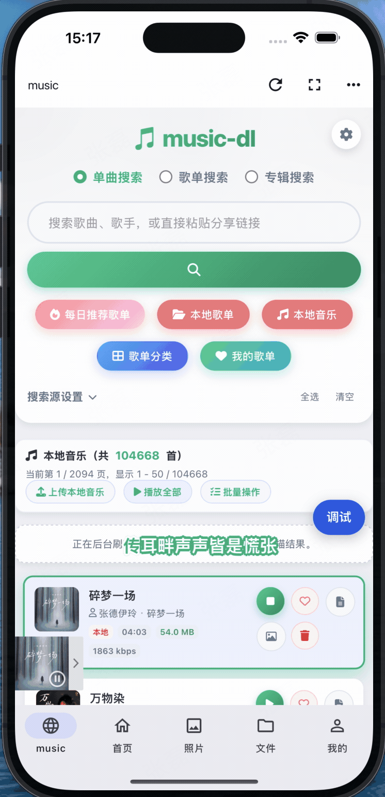

# Synology Cloud

> 🚀 一个现代化的 Synology NAS 客户端，致力于将文件、相册、视频、音乐、Docker、Web 服务等能力整合到一个应用中，为 NAS 用户提供更流畅、更易用的移动端体验。

------

## ✨ 功能特性

目前已支持（持续更新）：

- 📁 文件管理
  - 文件浏览
  - 上传 / 下载
  - 分享文件
  - 文件复制、移动、删除
- 📷 相册
  - 图片浏览
  - 幻灯片播放
  - 图片预览
- 🎬 视频
  - 视频播放
  - 视频预览
- 🎵 音乐
  - 音乐播放
  - 后台播放
- 🌐 Web 服务
  - 内置 WebView
  - Web 服务快速访问
- 🐳 Docker（开发中）
- 📝 笔记（开发中）

------

## 📱 下载

Android APK：

> 当前版本：**v0.0.12（内测）**

## 🎥 产品演示

### 文件管理

------

### 相册

<video src="https://github.com/user-attachments/assets/5041b02e-0c66-4998-9549-68a3fd9daabd" controls width="320"></video>

------

### 音乐

<video src="https://github.com/user-attachments/assets/f3811a48-2a73-4fd5-a263-2fc58d6d6a66" controls width="320"></video>

------

### 文件分享

<video src="https://github.com/user-attachments/assets/f41f002e-1972-4fee-914c-a3a2efccb711" controls width="320"></video>

------

### 视频播放

<video src="https://github.com/user-attachments/assets/63e08ae1-1c08-4a47-b580-fa0396812576" controls width="320"></video>

------

### 自定义 WebView

<video src="https://github.com/user-attachments/assets/ee6c5383-b38e-4fa2-af58-715994d4f9c8" controls width="320"></video>

------

## 🎯 为什么选择 Synology Cloud？

官方应用通常将文件、照片、视频、音乐等能力拆分为多个独立 App。

Synology Cloud 希望提供统一的使用体验：

- 一个 App 管理 NAS 全部内容
- 更符合国内用户的交互习惯
- 更流畅的动画与性能表现
- 持续迭代更多 NAS 场景

------

## 🛠 技术选型

项目最终采用 **Flutter** 开发。

在项目早期，对最新版 React Native 与 Flutter 进行了大量性能测试，重点验证了相册浏览、长列表滚动以及图片加载等高频场景。综合流畅度、稳定性及维护成本后，最终选择 Flutter 作为客户端技术栈。

React Native 与 Flutter 滚动性能对比：

<video src="https://github.com/user-attachments/assets/e349f00c-3298-45dd-a7bf-d1d1f9e0e5a7" controls width="320"></video>

------

## 🤝 参与贡献

欢迎任何形式的贡献：

- 🐞 提交 Issue
- 💡 提出功能建议
- 🔧 提交 Pull Request
- 💬 参与功能讨论

如果你也是 Synology NAS 用户，非常欢迎一起完善这个项目。

## 💡 功能建议与开发计划

欢迎提出任何产品功能或体验建议。

例如：

- 📖 希望增加小说阅读器、PDF 阅读器等新功能
- 🏠 希望支持首页自定义，让用户自由组织首页功能
- 🎨 希望优化交互、动画或界面排版
- ⚡ 希望改进性能或使用体验

请登录 App 后，进入：

> **关于 Synology Cloud → 意见反馈**

提交你的建议。

经过审核并采纳的建议，我们会同步更新到：

> **关于 Synology Cloud → 开发计划与公告**

方便所有用户了解功能规划和开发进度。

期待与你一起打磨 Synology Cloud，让它变得越来越好 ❤️

## 💬 用户交流群

欢迎加入 Synology Cloud 用户交流群，与大家一起交流使用经验、反馈问题、提出功能建议。

> 微信群二维码有效期为 7 天，如果二维码失效，请刷新页面获取最新二维码。

👉 点击加入交流群：

## 📄 License

本项目基于 **GPL-3.0** 协议开源。

------

## ❤️ 说明

Synology Cloud 专注于提升 Synology NAS 的移动端体验。

如果你拥有 NAS，并希望通过一个应用完成文件、照片、视频、音乐等日常管理，那么它就是为你打造的。
